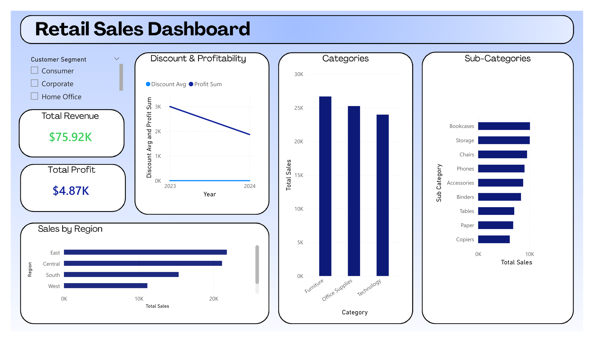

Retail Sales Dashboard

An interactive dashboard built to analyze retail sales performance across customer segments, product categories, and geographic regions.

---

##  Project Overview

This project simulates a real-world retail analytics workflow. Starting from raw sales data, I designed and built a fully interactive dashboard that enables business stakeholders to monitor revenue, profitability, regional performance, and product-level trends — all at a glance.

The goal was to answer key business questions:
- Where are we generating the most revenue, and where are margins thin?
- Which product categories and sub-categories drive the most sales?
- How has profitability trended over time relative to discounting behavior?
- Which regions are underperforming?

---

## Dashboard Features

### Customer Segment Filter
Dynamic filtering by **Consumer**, **Corporate**, and **Home Office** segments, enabling segment-specific analysis across all visuals.

### Discount & Profitability Trend (2023–2024)
A dual-line chart tracking average discount rates against total profit over time. Reveals a notable decline in profit sum from 2023 to 2024, raising a strategic question about the impact of discounting on margins — a finding that would directly inform pricing strategy.

### Sales by Region
Horizontal bar chart comparing total sales across East, Central, South, and West regions. The East and Central regions lead significantly, suggesting resource allocation and growth opportunity decisions for the South and West.

### Sales by Category
Breakdown across the three core categories — **Furniture, Office Supplies, and Technology** — with Furniture leading in total sales volume.

### Sales by Sub-Category
Granular view across 9 sub-categories including **Bookcases, Storage, Chairs, Phones, Accessories, Binders, Tables, Paper, and Copiers**, enabling identification of top-performing product lines.

---

## Tools & Technologies
- Microsoft Excel (Data Cleaning & Data Analysis)
- Power BI (Data Visualization)

---

## Insights & Business Takeaways

1. **Profit margins are under pressure** — the gap between revenue and profit warrants a review of discount strategy, particularly as profitability declined year-over-year.
2. **East region dominates** — nearly double the sales of the West region, indicating strong market penetration in the East but untapped potential elsewhere.
3. **Furniture leads in sales but warrants margin scrutiny** — high-volume categories don't always mean high-profit; a deeper profitability-by-category cut would be the natural next step.
4. **Sub-category winners** — Bookcases and Storage outperform all other sub-categories, suggesting these are core Stock keeping units worth prioritizing in inventory and marketing.

